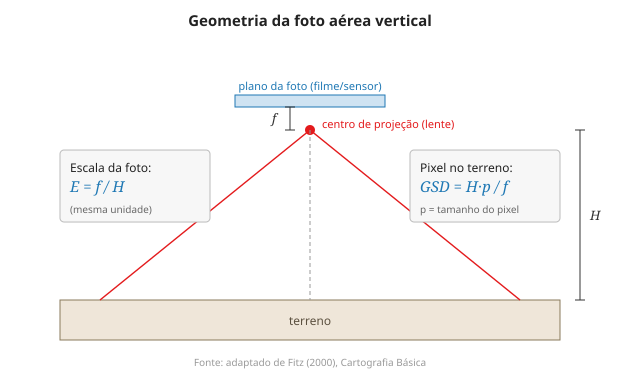

# Aula 7 — Escala: numérica, gráfica, generalização e escala da foto

**Onde:** sala + laboratório (QGIS) · **Módulo:** I

## Objetivos

- Aprofundar escala numérica e gráfica e a relação escala–generalização.
- Calcular medições sobre a carta (distâncias, áreas) e discutir o erro gráfico.
- Deduzir a escala da fotografia aérea (E = f/H), preparando a fotogrametria.

## Teoria

Retomando a Aula 1 com profundidade: a escala **gráfica** sobrevive a ampliações e reduções justamente porque acompanha a distorção do papel, enquanto a **numérica** deixa de valer se o mapa for esticado (Fitz, 2000, cap. "Escalas"). A **generalização** liga-se ao **erro gráfico**: um traço não deve implicar erro menor que ~0,1–0,2 mm no papel, o que, multiplicado pela escala, define o menor detalhe confiável — 0,2 mm valem 10 m em 1:50.000 e 0,4 m em 1:2.000. Medições sobre a carta (distância por régua/coordenadas; área por quadrícula) herdam essa limitação, e a **escala só pode ser reduzida, nunca ampliada**, sem perda de confiabilidade.

A ponte para o Módulo II é a **escala da fotografia aérea**: por semelhança de triângulos na câmara, **E = f/H** (distância focal sobre altura de voo) e o pixel no terreno **GSD = H·p/f** (Fitz, 2000, cap. "Aerofotogrametria e sensoriamento remoto"). O aluno resolve um exemplo numérico de escala de foto e recobrimento — o mesmo tipo de conta que, na Aula 11, dará sentido à estereoscopia. No QGIS, a ferramenta de medição e o controle de escala fecham a parte prática.

## Roteiro (3h)

| Bloco | Descrição |
|-------|-----------|
| Teoria | Escala numérica e gráfica; generalização e erro gráfico; escala da foto (E = f/H, GSD) |
| Prática | No QGIS, medir distâncias e áreas; comparar escalas; exercício numérico de escala da foto |

## Laboratório

**[Ex. 07 — Escala, medições e escala da foto](../exercicios/ex-07-escala.md)**

## Leituras

- FITZ, P. R. *Cartografia básica*, cap. "Escalas" e "Uso prático das cartas topográficas" (medições).
