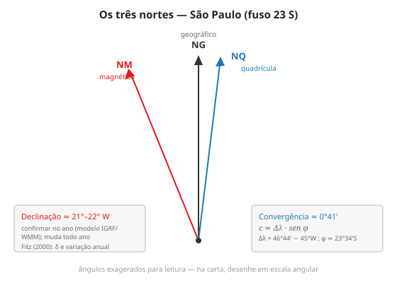

# Aula 9 — Norte, azimute e medidas angulares

**Onde:** sala + laboratório (QGIS) · **Módulo:** II — Da imagem ao relevo

## Objetivos

- Distinguir norte geográfico, magnético e da quadrícula.
- Calcular a declinação e a convergência meridiana de São Paulo.
- Medir e converter azimutes.

## Teoria

Perguntar "onde é o norte?" tem três respostas, e a carta topográfica dá as três. O **norte geográfico (NG)** aponta para o polo, ao longo do meridiano. O **norte magnético (NM)** é para onde a bússola aponta; a diferença angular para o NG é a **declinação magnética (δ)**, que varia no espaço e no tempo — por isso a folha traz a declinação com data e variação anual (Fitz, 2000, cap. "A representação cartográfica"). Em Campinas, δ é da ordem de 21°–22° W e precisa ser confirmada no modelo do ano.

O **norte da quadrícula (NQ)** é a direção das linhas verticais da malha UTM. Como a quadrícula é paralela ao meridiano central e os meridianos convergem para o polo, o NQ só coincide com o NG sobre o meridiano central; em qualquer outro ponto há a **convergência meridiana (γ)**, aproximada por *c ≈ Δλ · sen φ*. Para Campinas (Δλ = 47°03'−45° W; φ ≈ 22°54' S), γ é da ordem de **0°48'** — um pouco maior que a de São Paulo, por estar mais longe do meridiano central. O **azimute** de um alinhamento é o ângulo horário a partir do norte (0°–360°); trabalhar exige converter entre azimute magnético, verdadeiro e da quadrícula. No QGIS, medir azimutes de alinhamentos e desenhar o diagrama de declinação da futura carta amarra a teoria.

## Roteiro (3h)

| Bloco | Descrição |
|-------|-----------|
| Teoria | Os três nortes; declinação e variação; convergência; azimute e rumo |
| Prática | Calcular γ e δ de São Paulo; desenhar o diagrama de declinação; medir azimutes no QGIS |

## Laboratório

**[Ex. 09 — Os três nortes e o azimute](../exercicios/ex-09-nortes-azimute.md)**

## Leituras

- FITZ, P. R. *Cartografia básica*, cap. "A representação cartográfica" (direção norte, rumos e azimutes).
