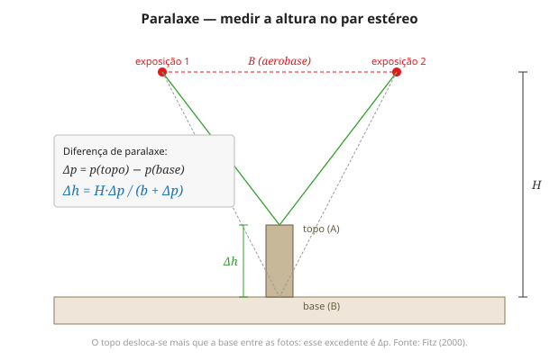

# Aula 11 — Estereoscopia e paralaxe

**Onde:** bancada (estereoscópio) + laboratório (QGIS) · **Módulo:** II

## Objetivos

- Compreender a visão estereoscópica e a paralaxe.
- Ver o relevo em um par de fotos aéreas.
- Medir alturas por paralaxe; relacionar o relevo de Campinas com a expansão urbana.

## Teoria

Vemos profundidade porque cada olho recebe uma imagem ligeiramente diferente — a **paralaxe** — que o cérebro interpreta como distância. A fotogrametria replica isso: duas fotos aéreas adjacentes, tomadas de posições diferentes com **recobrimento longitudinal de ~60%**, formam um **par estéreo**; a distância entre exposições é a **aerobase (B)**, análoga à separação dos olhos, e o estereoscópio força cada olho a ver uma foto, fazendo o terreno saltar em 3D (Fitz, 2000, cap. "Aerofotogrametria e sensoriamento remoto"). Marca-se o ponto principal e o transferido, define-se a base fotográfica (b), e surge o **exagero vertical** — o relevo parece mais dramático do que é.

Da percepção à medida: a **diferença de paralaxe** entre o topo e a base de um objeto carrega sua altura, por **Δh = H·Δp/(b+Δp)**. O material é um **par de fotos aéreas** (acervo do Departamento/LASERE ou par-amostra), visto no **estereoscópio de bolso**. Em paralelo, no QGIS, visualizamos o **MDE de Campinas** em 3D. Sobrepondo as manchas urbanas do Ex. 03, começamos a testar uma hipótese que a Aula 13 fechará com números: **a expansão urbana ocupou ou evitou certas declividades?**

## Roteiro (3h)

| Bloco | Descrição |
|-------|-----------|
| Teoria | Visão binocular, paralaxe, ponto principal e base, exagero vertical |
| Prática (bancada) | Montar e ver o par no estereoscópio; medir altura por paralaxe |
| Prática (QGIS) | Visualizar o MDE de Campinas em 3D; sobrepor as manchas urbanas |

## Laboratório

**[Ex. 11 — Estereoscopia e paralaxe](../exercicios/ex-11-estereoscopia.md)**

## Leituras

- FITZ, P. R. *Cartografia básica*, cap. "Aerofotogrametria e sensoriamento remoto" (estereoscopia, paralaxe, fotointerpretação).
