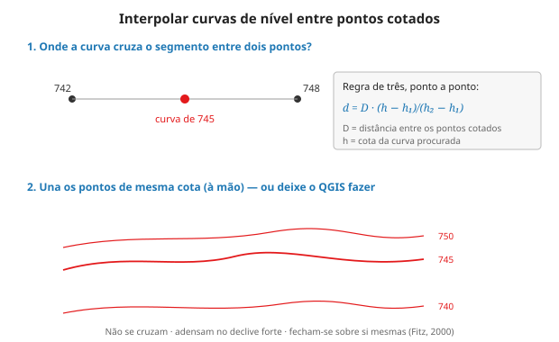
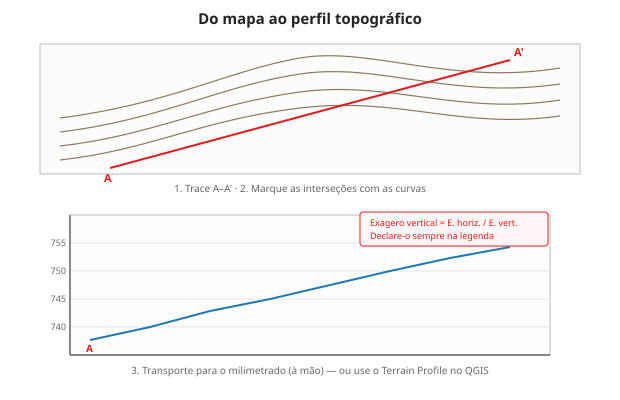

# Ex. 12 — Curvas de nível e perfil (analógico + QGIS), Campinas

**Aula:** 12 · **Ferramenta:** prancheta + QGIS · **Duração:** ~3h

## Objetivo

Traçar curvas à mão e gerá-las no QGIS a partir do MDE de Campinas; construir o perfil topográfico nos dois formatos e compará-los.

## Material / dados

- **Malha de pontos cotados** (A3, ~20–40 pontos) extraída do MDE da sub-região — o docente prepara.
- Papel vegetal, milimetrado, régua, lapiseira.
- QGIS + **MDE** da sub-região; complemento **Terrain Profile**.

## Parte A — Curvas à mão (60 min)

1. Escolha a **equidistância** (ex.: 10 m; ajuste à amplitude da sua sub-região). Justifique.
2. Para cada par de pontos vizinhos: **d = D·(h−h₁)/(h₂−h₁)**.
   - *Exemplo:* pontos a 12 cm, cotas 620 e 640, curva de 630 → d = 12·(10/20) = 6 cm.
3. Uma cota por vez; una com traçado suave; diferencie as **mestras**.

## Parte B — Curvas no QGIS (40 min)

4. **Raster → Extração → Curvas de Nível** sobre o MDE; intervalo = a mesma equidistância.
5. Estilize (mestras) e sobreponha à imagem e às manchas urbanas.

## Parte C — Comparar (20 min)

6. Sobreponha suas curvas manuais às do QGIS. Onde coincidem/divergem, e por quê (densidade de pontos, suavização, decisão de traçado)?

## Parte D — Perfil topográfico (60 min)

7. **À mão:** trace A–A' **cruzando a franja de expansão** (do rural de 1980 ao urbano atual); marque interseções com as curvas; transporte para o milimetrado; **declare o exagero vertical**.

8. **No QGIS:** complemento **Terrain Profile**, mesmo A–A' sobre o MDE. Compare.
9. **Leitura:** o perfil mostra que a cidade cresceu subindo encosta? descendo para o vale? Registre — conecta com o Ex. 03 e a Aula 13.

## Discussão

- Que suposição você fez sobre o terreno entre dois pontos? O QGIS faz a mesma?
- O software é "mais certo" ou mais rápido e consistente?

## Entrega

- [ ] Curvas manuais (vegetal) + curvas do QGIS + sobreposição.
- [ ] Perfil manual (exagero declarado) e do QGIS, cruzando a franja de expansão.
