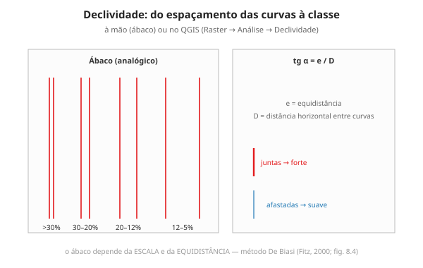

# Ex. 13 — Hipsometria, clinografia e a expansão sobre o relevo

**Aula:** 13 · **Ferramenta:** QGIS · **Duração:** ~2h30

## Objetivo

Produzir cartas hipsométrica e clinográfica do MDE de Campinas, delimitar uma bacia, e **testar a hipótese** da Aula 11: a expansão urbana ocupou/evitou quais declividades?

## Material / dados

- QGIS + **MDE** da sub-região + as **manchas urbanas** (1980 e atual, Ex. 03).

## Parte A — Carta hipsométrica (30 min)

1. MDE → **Propriedades → Simbologia → Banda simples pseudocor** → classes de altitude (intervalo igual, 5–6 classes; verde → marrom).
2. Compare com o modo *Quantil*. Nenhum dado mudou — a imagem mudou?

## Parte B — Carta clinográfica (50 min)

3. **Raster → Análise → Declividade** sobre o MDE (em graus).
4. Converta para % na **Calculadora raster**: `tan("declive@1"*pi()/180)*100`.
5. Reclassifique em classes: **≤5, 5–12, 12–20, 20–30, >30%** (*Raster → Análise → Reclassificar por tabela* ou *r.reclass*).
6. Estilize e anote o significado dos limiares (urbanístico, aptidão, risco — Fitz, 2000).

## Parte C — A expansão × a declividade (40 min)

Este é o cruzamento que fecha o estudo de caso.

7. Sobreponha as **manchas urbanas** à carta de declividade.
8. Recorte a declividade pela mancha de **1980** e pela **atual** (*Raster → Extração → Recortar raster por camada de máscara*).
9. Compare os **histogramas** de declividade das duas manchas (*Propriedades → Histograma*, ou estatísticas zonais):
   - A cidade de 1980 estava em terreno mais plano?
   - A expansão (a diferença) avançou sobre declividades maiores? Sobre áreas de risco (>30%)?
10. Responda à hipótese da Aula 11 com **números**.

## Parte D — Bacia hidrográfica (30 min)

11. Preencha depressões do MDE (*Fill sinks*); gere direção/acumulação de fluxo (*r.watershed*).
12. Delimite a **bacia** a montante de um exutório; sobreponha à hidrografia e às manchas.
13. A expansão urbana invadiu fundos de vale / áreas próximas aos cursos d'água?

## Discussão

- A hipsométrica e a clinográfica descrevem o mesmo relevo — por que parecem tão diferentes?
- O que a declividade revela sobre **como** e **onde** Campinas cresceu?

## Entrega

- [ ] Carta hipsométrica (2 versões de classes).
- [ ] Carta clinográfica (classes 5/12/20/30%).
- [ ] Comparação de declividade entre mancha de 1980 e atual (com números) + resposta à hipótese.
- [ ] Bacia delimitada.
