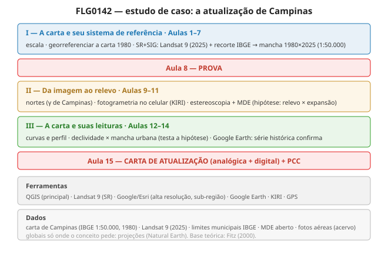

# FLG0142 — Elementos de Cartografia Sistemática

**Departamento de Geografia · FFLCH-USP** · 4+2 créditos · 120h · **20h de PCC** · 15 encontros.

---

## O curso

Os elementos que tornam uma **carta topográfica** um documento utilizável — escala, referenciais, projeções, coordenadas, os três nortes, curvas de nível, perfil — e a relação da Cartografia com suas áreas vinculadas: **Cartografia Temática, Sensoriamento Remoto, SIG e GPS**.

O fio condutor é um **estudo de caso de Campinas**: georreferenciar a carta topográfica de 1980, descobrir a **desatualização** sobre a imagem atual, e **atualizar** a cartografia — medindo a **expansão urbana em 40 anos** e explicando-a pelo relevo. Formatos **analógico e digital**.

## Ferramentas

- **QGIS** — ambiente principal das práticas.
- **Landsat 9 (2025)** — atualização regional da mancha urbana (SR).
- **Google/Esri Satellite** (XYZ) — detalhe da sub-região.
- **Google Earth Pro** — SIG, série histórica e uso didático.
- **KIRI Engine** — fotogrametria com o celular (gratuito, iOS/Android/web).
- **App de GPS** (GPS & Maps) — coleta de coordenadas no celular.

Sem drone e sem campo noturno. Sequência encadeada com insumo pronto a cada etapa.

## Navegação

- :material-file-document: **[Plano de ensino](plano-de-ensino.md)** — estrutura, avaliação, PCC
- :material-cog: **[Ambiente](ambiente/setup-qgis.md)** — instalar QGIS, Google Earth, apps
- :material-database: **[Dados](dados/fontes-de-dados.md)** — GeoSampa, IBGE
- :material-school: **[Aulas 1–15](aulas/aula-01.md)** — teoria (Fitz) + prática
- :material-pencil-ruler: **[Exercícios](exercicios/index.md)** — passo a passo (QGIS, GPS, KIRI, estéreo)

---

Material sob **CC BY 4.0**. Base teórica: FITZ, P. R. *Cartografia básica* (2000).
